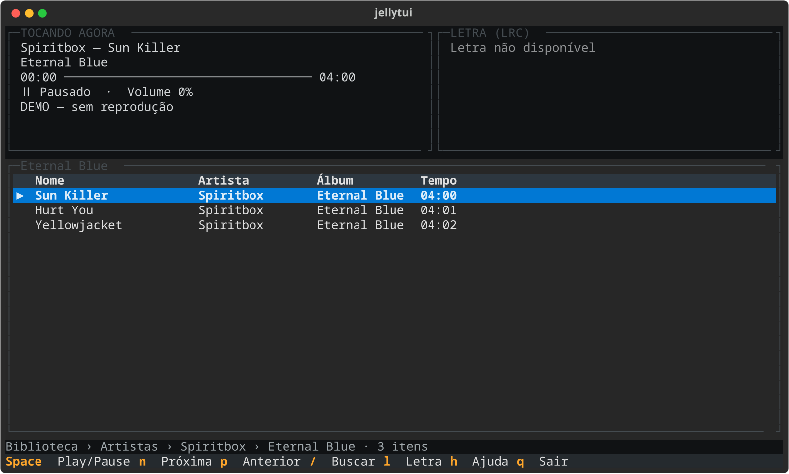

**[ [English](README.md) | Português ]**

# jellytui

[](https://github.com/xHitech/jellytui/releases)
[](https://www.python.org)
[](https://textual.textualize.io)
[](https://www.kernel.org)
[](LICENSE)

Um reprodutor de música em terminal para Jellyfin, construído com Textual e mpv.

- Direct Play de alta fidelidade
- Letras sincronizadas (LRC)
- Interface de terminal (TUI) rápida e orientada a teclado
- Navegação por Artistas, Álbuns, Pastas, Playlists e Favoritos
- Busca instantânea e fila de reprodução contextual
- Empacotamento nativo para Arch Linux

## Screenshot

<p align="center">
  
</p>

> [!NOTE]
> Você também pode explorar a interface interativamente em modo demonstração offline, sem necessidade de conexão com um servidor, executando `jellytui --demo`.

## Recursos

- **Navegação musical hierárquica e paginada:** Navegue por Artistas, Álbuns, Pastas, Playlists e Favoritos sem sobrecarregar a memória.
- **Reprodução via mpv:** Áudio de alta fidelidade gerenciado por processo mpv dedicado e controlado via IPC JSON assíncrono em socket Unix privado.
- **Direct Play original:** Prioriza o stream estático original sem transcodificação arbitrária, respeitando formatos como FLAC, MP3, AAC e Opus.
- **Letras sincronizadas (LRC):** Suporte à API oficial de letras do Jellyfin (`/Audio/{itemId}/Lyrics`) e parser de arquivos `.lrc`, com sincronização precisa baseada no relógio do mpv.
- **Fila e contexto contínuo:** A seleção de qualquer faixa cria dinamicamente uma fila a partir do contexto atual (álbum, artista, playlist ou busca), com avanço automático até o término.
- **Interface responsiva em Textual:** Layout flexível para diferentes dimensões de terminal, colunas adaptativas conforme a categoria e painel Now Playing compacto.
- **Segurança de credenciais:** Armazenamento isolado no padrão XDG com permissões estritas (`0600`). A senha nunca é salva em disco e o token não é exposto na lista de processos.

## Instalação

### Requisitos

- Linux
- Python 3.11+
- [mpv](https://mpv.io) instalado e disponível no sistema (`mpv` no `PATH`)

### Arch Linux (PKGBUILD)

Recomendado no Arch Linux para gerenciar dependências nativamente via pacman:

```bash
git clone https://github.com/xHitech/jellytui
cd jellytui/packaging/arch
makepkg -si
```

### Python / venv (Alternativa)

```bash
git clone https://github.com/xHitech/jellytui
cd jellytui
python3 -m venv .venv
source .venv/bin/activate
pip install .
```

Para instalar em modo de desenvolvimento com as dependências da suíte de testes:

```bash
pip install -e '.[test]'
```

## Primeira Configuração

Na primeira utilização, configure a conexão com o servidor executando o assistente:

```bash
jellytui --setup
```

O assistente solicitará:
1. **URL do servidor** (padrão: `http://127.0.0.1:8096`)
2. **Usuário**
3. **Senha** (digitada de forma invisível, usada apenas para autenticar via API e nunca persistida em disco)

Após a autenticação bem-sucedida, a interface abre automaticamente. Em execuções seguintes, basta iniciar:

```bash
jellytui
```

### Utilitários e Diagnóstico

```bash
jellytui --setup      # Reconfigurar servidor/usuário e encerrar
jellytui --check      # Validar autenticação, conectividade e contagem da biblioteca
jellytui --check-play # Testar fluxo completo com mpv e áudio silencioso
jellytui --demo       # Abrir a interface em modo demonstração offline (sem rede)
```

## Controles

A navegação é totalmente orientada a atalhos de teclado:

| Tecla | Ação |
| --- | --- |
| `↑` / `k`, `↓` / `j` | Subir / descer na lista de itens |
| `Enter` | Abrir pasta/categoria ou reproduzir a partir da faixa selecionada |
| `Backspace` | Voltar um nível na navegação (preserva seleção anterior) |
| `PageUp` / `PageDown` | Rolar uma página acima / abaixo |
| `Home` / `End` | Ir para o primeiro / último item |
| `Tab` / `Shift+Tab` | Alternar foco entre componentes interativos |
| `Space` | Reproduzir / pausar áudio |
| `n` / `p` | Próxima / anterior faixa da fila |
| `←` / `→` | Retroceder / avançar 5 segundos na faixa |
| `+` ou `=` / `-` | Aumentar / diminuir volume em 5% (também aceita Numpad `+` e `-`) |
| `/` | Iniciar busca por faixas, álbuns ou artistas |
| `Enter` / `Escape` na busca | Confirmar busca / cancelar e fechar |
| `f` | Alternar favorito do item selecionado |
| `Q` (maiúsculo) | Exibir a fila de reprodução local |
| `l` | Alternar exibição do painel de letras sincronizadas |
| `h` | Abrir / fechar modal com a listagem completa de ajuda |
| `Escape` | Fechar modal de ajuda ou barra de busca |
| `q` | Sair do aplicativo e finalizar o mpv |

Pressione `h` a qualquer momento para abrir o modal com todas as teclas e descrições detalhadas.

**Comportamento da fila:** Pressionar `Enter` na terceira faixa de uma lista de cinco itens gera a fila `[faixa 3, faixa 4, faixa 5]`. O fim de uma música avança automaticamente para a próxima até esgotar a fila. A navegação por outras seções da biblioteca não altera a reprodução ativa até que um novo item seja explicitamente reproduzido.

## Letras Sincronizadas

O aplicativo integra-se diretamente ao endpoint oficial do Jellyfin (`GET /Audio/{itemId}/Lyrics`):

- **Sincronização em tempo real:** A posição do cursor nas estrofes acompanha o tempo real do mpv (`time-pos`) consultado via IPC, sem depender de relógios locais desfasados.
- **Exibição limpa:** Mostra a estrofe atual destacada, acompanhada das linhas anteriores e posteriores para contexto. O painel redesenha apenas quando a linha ou estado mudam.
- **Parser LRC:** Suporta arquivos estruturados pelo servidor ou no formato padrão LRC com frações de segundo e múltiplos marcadores de tempo por linha.
- Faixas sem letra catalogada ou sem marcações temporais exibem status informativo sem travar o áudio ou emitir erros intrusivos.

## Reprodução / Direct Play

- **Direct Play:** O cliente negocia `POST /Items/{itemId}/PlaybackInfo` requisitando áudio direto. Quando o Jellyfin permite Direct Play, consome o stream original estático (`/Audio/{itemId}/stream?static=true`), preservando a fidelidade nativa e taxa de amostragem sem reencodificação desnecessária.
- Se o servidor requerer transcodificação, uma notificação explicativa é exibida na interface.
- **Processo mpv desacoplado:** O mpv executa em segundo plano com as opções `--no-config --no-video --audio-display=no --idle=yes`. A comunicação utiliza JSON IPC sobre socket Unix temporário privado, encerrado de forma limpa ao sair.
- Não realiza download permanente de arquivos nem modificação de metadados no servidor.

## Configuração e Segurança

As configurações ficam armazenadas em `$XDG_CONFIG_HOME/jellytui/config.toml` (padrão: `~/.config/jellytui/config.toml`):

- **Permissões rígidas:** O arquivo é gerado de forma atômica com permissão `0600` (leitura e escrita restritas ao proprietário). Arquivos pré-existentes com permissões abertas são rejeitados na inicialização.
- **Privacidade de senhas:** A senha fornecida no `--setup` é utilizada exclusivamente no handshake de login e nunca é gravada em disco.
- **Tokens seguros:** O token de sessão é passado ao mpv por meio de IPC Unix em memória, nunca pela linha de comando ou variáveis visíveis via `ps`.

## Empacotamento

O repositório fornece receitas prontas para distribuições Linux dentro do diretório `packaging/`:

- [packaging/arch/PKGBUILD](packaging/arch/PKGBUILD): Receita oficial para a release estável com verificação de integridade via SHA-256.
- [packaging/arch/.SRCINFO](packaging/arch/.SRCINFO): Metadados sincronizados para o pacote no Arch Linux.
- [packaging/arch-git/PKGBUILD](packaging/arch-git/PKGBUILD): Receita para desenvolvimento contínuo a partir da branch principal (`main`).

Para instruções sobre como compilar e instalar o pacote, consulte a seção [Instalação](#arch-linux-pkgbuild).

## Desenvolvimento e Testes

### Arquitetura do Código

```text
jellytui/
  __init__.py
  __main__.py           Ponto de entrada CLI e configuração interativa
  app.py                TUI em Textual, ciclo de vida e navegação
  config.py             Gerenciamento seguro de configuração TOML
  jellyfin.py           Cliente HTTP assíncrono para a API do Jellyfin
  player.py             Gerenciamento do processo mpv e controle IPC Unix
  models.py             Modelos de dados de faixas, álbuns e filas
  lyrics.py             Parser de letras sincronizadas LRC e busca temporal
  controls.py           Mapeamento central de teclas e ações
  demo.py               Dados simulados para o modo demonstração
  widgets/
    browser.py          Navegação nas categorias da Biblioteca
    now_playing.py      Painel de metadados, progresso e status
    track_list.py       Tabela responsiva de listagem e navegação
    lyrics.py           Painel com rolagem de letras sincronizadas
    help.py             Modal de atalhos e ajuda
tests/                  Suíte de testes automatizados unitários, TUI e mpv
packaging/              Empacotamento para distribuições Linux (Arch)
assets/                 Recursos visuais e capturas de tela
```

### Execução dos Testes

```bash
# Executar a suíte de testes completa
pytest -q

# Teste opcional contra servidor Jellyfin real ativo
JELLYTUI_LIVE_TEST=1 pytest tests/test_live.py -q
```

- Status atual: **59 passed**, **1 skipped** (teste opt-in para servidor real).
- Os testes com mpv utilizam saída de áudio `null` silenciosa sem interferir nos dispositivos de reprodução do sistema.

## Limitações

- **Foco estrito em música:** Não processa vídeo, capas gráficas em alta resolução ou elementos de interface gráfica tradicional.
- **Fila em memória:** A fila de reprodução é mantida durante a sessão atual e não persiste após o fechamento do programa.
- **Sem download offline:** Todas as faixas são reproduzidas diretamente por streaming a partir do servidor Jellyfin.
- **Letras existentes:** Apenas exibe letras já catalogadas pelo servidor Jellyfin; não realiza consultas nem uploads para fontes externas.
- **Mixer do sistema:** Volume e configurações de dispositivo dependem da configuração do subsistema de áudio Linux (PipeWire/PulseAudio/ALSA).

## Licença

Distribuído sob a licença [MIT](LICENSE). Consulte o arquivo [LICENSE](LICENSE) para mais detalhes.
